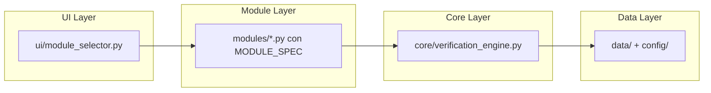

# Struttura Modulare del Progetto RD2229

La struttura è stata standardizzata per massima modularità, seguendo buone prassi (separazione di responsabilità, discovery automatica, documentazione integrata).

## Directory Structure

```
RD2229/
├── modules/              # Moduli logici (auto-discovery)
│   ├── historical_placeholder.py (placeholder)
│   ├── material_editor.py        (funzionante, avvia editor)
│   ├── frc_placeholder.py        (placeholder)
│   ├── geometry.py               (calcolo caratteristiche sezioni)
│   ├── carbon_fiber_placeholder.py (placeholder)
│   └── debug_viewer.py           (funzionante)
├── ui/                        (interfacce GUI, incluso module_selector.py)
├── core/                      (logica calcolo, engine)
├── config/                    (loader, config)
├── data/                      (dati persistenti)
├── scripts/                   (utility, test-runner)
├── docs/                      (documentazione generata)
├── tests/                     (unit test)
└── src/launcher/              (bootstrap, mantenuto dal refactoring precedente)
```

## Moduli Disponibili

- **Geometry Module**: Creazione e calcolo caratteristiche delle sezioni (funzionante).
- **Historical Module**: Placeholder per materiali storici.
- **Material Editor**: Editor materiali storici completamente funzionante.
- **FRC Module**: Placeholder per verifiche FRC.
- **Carbon Fiber Placeholder**: Placeholder per fibre di carbonio.
- **Debug Viewer**: Strumento per visualizzare log e debug (funzionante).

## Discovery Automatica

Il `ModuleSelector` scansiona automaticamente la cartella `modules/` per file Python contenenti `MODULE_SPEC`. Ogni modulo deve definire:

```python
MODULE_SPEC = {
    "key": "nome_modulo",
    "name": "Nome Modulo",
    "description": "Descrizione",
}

def create_module(master=None, **kwargs):
    # Logica per creare la finestra del modulo
    return WindowInstance(master)
```

## Schemi di Funzionamento

### Diagramma di Flusso del Module Selector

```mermaid
graph TD
    A[Avvio App] --> B[Carica Module Selector]
    B --> C[Scansiona modules/ per *.py]
    C --> D[Importa moduli con MODULE_SPEC]
    D --> E[Mostra lista moduli nell'UI]
    E --> F[Utente seleziona modulo]
    F --> G[Esegui run_function del modulo]
    G --> H[Placeholder: mostra messaggio | Funzionante: avvia logica]
```

### Diagramma Architetturale



## Guida per Sviluppatori: Aggiungere un Nuovo Modulo

1. Crea `modules/<nome_modulo>.py` con struttura standard:

   ```python
   MODULE_SPEC = {
       "key": "nome_modulo",
       "name": "Nome Modulo",
       "description": "Descrizione del modulo",
   }

   def create_module(master=None, **kwargs):
       # Implementa la logica per avviare il modulo
       return ModuleWindow(master)
   ```

2. Il selector lo rileverà automaticamente (nessuna modifica manuale).
3. Aggiungi test in `tests/test_<nome>.py`.
4. Aggiorna questa documentazione se necessario.

Questa struttura garantisce estensibilità, mantenendo separazione funzionale e facilitando lo sviluppo professionale. 🚀</content>
<parameter name="filePath">c:\workspaces\RD2229\RD2229\docs\module_structure.md
