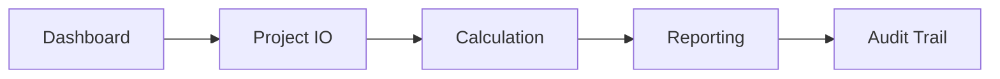

---
title: Master Matrix Pipelines RD2229
last_sync: 2026-03-26
maintainers:
  - Daniele Carloni
tags: [pipelines, matrix, governance]
source_of_truth: docs/PIANO_LAVORO.md, docs/PIANO_LAVORO_GUI.md
status: active
---

# MASTER MATRIX - Pipeline RD2229

## Scopo
Matrice operativa unica per pipeline di prodotto e integrazione dashboard.

## Distinzione terminologica
- Pipeline tecnica: codice eseguibile in core e servizi.
- Pipeline di prodotto: flusso standard utente con gate e artefatti.

## Tassonomia completa P0-P29
Copertura estesa all modules: operative, parziali, roadmap.

## Matrice operativa
| Pipeline | Nome | Stato | Gate | Artefatti | Hook codice | KPI |
|---|---|---|---|---|---|---|
| P00 | Core Orchestrator | operativa | dati minimi unita norma audit | ResultsModel ReportArtifact ActionReport | src/core/pipeline.py | copertura ripetibilita tempo |
| P01 | Verifiche NTC2018 | operativa | dati minimi unita norma audit | ResultsModel ReportArtifact ActionReport | src/methods/ntc2018/checks.py | copertura ripetibilita tempo |
| P02 | Verifiche DM96 TA SLU | operativa | dati minimi unita norma audit | ResultsModel ReportArtifact ActionReport | src/methods/dm96/checks.py | copertura ripetibilita tempo |
| P03 | Verifiche RD2229 TA | operativa | dati minimi unita norma audit | ResultsModel ReportArtifact ActionReport | src/methods/rd2229/checks.py | copertura ripetibilita tempo |
| P04 | Muratura Cinematica | parziale | dati minimi unita norma audit | ResultsModel ReportArtifact ActionReport | src/methods/muratura/cinematica.py | copertura ripetibilita tempo |
| P05 | Muratura Scorrimento | parziale | dati minimi unita norma audit | ResultsModel ReportArtifact ActionReport | src/methods/muratura/resistenza.py | copertura ripetibilita tempo |
| P06 | Muratura Cantonali | parziale | dati minimi unita norma audit | ResultsModel ReportArtifact ActionReport | src/methods/muratura/cantonale.py | copertura ripetibilita tempo |
| P07 | Fuoco | operativa | dati minimi unita norma audit | ResultsModel ReportArtifact ActionReport | src/fire | copertura ripetibilita tempo |
| P08 | Vento | operativa | dati minimi unita norma audit | ResultsModel ReportArtifact ActionReport | src/wind | copertura ripetibilita tempo |
| P09 | Sismica Spettri | operativa | dati minimi unita norma audit | ResultsModel ReportArtifact ActionReport | src/codes/ntc2018 | copertura ripetibilita tempo |
| P10 | Sismica Modale | operativa | dati minimi unita norma audit | ResultsModel ReportArtifact ActionReport | src/seismic | copertura ripetibilita tempo |
| P11 | Sismica Fattori Struttura | operativa | dati minimi unita norma audit | ResultsModel ReportArtifact ActionReport | src/seismic | copertura ripetibilita tempo |
| P12 | Pushover | parziale | dati minimi unita norma audit | ResultsModel ReportArtifact ActionReport | src/seismic/pushover.py | copertura ripetibilita tempo |
| P13 | FEM 2D | operativa | dati minimi unita norma audit | ResultsModel ReportArtifact ActionReport | src/fem | copertura ripetibilita tempo |
| P14 | Carote Materiali | operativa | dati minimi unita norma audit | ResultsModel ReportArtifact ActionReport | src/materials | copertura ripetibilita tempo |
| P15 | Fondazioni | operativa | dati minimi unita norma audit | ResultsModel ReportArtifact ActionReport | src/foundation | copertura ripetibilita tempo |
| P16 | Liquefazione | operativa | dati minimi unita norma audit | ResultsModel ReportArtifact ActionReport | src/geotech | copertura ripetibilita tempo |
| P17 | Cedimenti | operativa | dati minimi unita norma audit | ResultsModel ReportArtifact ActionReport | src/geotech | copertura ripetibilita tempo |
| P18 | Elementi Secondari | operativa | dati minimi unita norma audit | ResultsModel ReportArtifact ActionReport | src/secondary_elements | copertura ripetibilita tempo |
| P19 | FRP | operativa | dati minimi unita norma audit | ResultsModel ReportArtifact ActionReport | src/frp | copertura ripetibilita tempo |
| P20 | Connessioni | operativa | dati minimi unita norma audit | ResultsModel ReportArtifact ActionReport | src/connections | copertura ripetibilita tempo |
| P21 | Strutture Esistenti | operativa | dati minimi unita norma audit | ResultsModel ReportArtifact ActionReport | src/existing | copertura ripetibilita tempo |
| P22 | Project IO | operativa | dati minimi unita norma audit | ResultsModel ReportArtifact ActionReport | src/project/repository.py | copertura ripetibilita tempo |
| P23 | Material Repository | operativa | dati minimi unita norma audit | ResultsModel ReportArtifact ActionReport | src/materials/repository.py | copertura ripetibilita tempo |
| P24 | Section Repository | operativa | dati minimi unita norma audit | ResultsModel ReportArtifact ActionReport | src/sections/repository.py | copertura ripetibilita tempo |
| P25 | Report Multi Norma | operativa | dati minimi unita norma audit | ResultsModel ReportArtifact ActionReport | src/reporting/report_builder.py | copertura ripetibilita tempo |
| P26 | Audit Trail | operativa | dati minimi unita norma audit | ResultsModel ReportArtifact ActionReport | src/reporting/x6_report_pipeline.py | copertura ripetibilita tempo |
| P27 | GUI Moderna | operativa | dati minimi unita norma audit | ResultsModel ReportArtifact ActionReport | src/ui/modern/main_window.py | copertura ripetibilita tempo |
| P28 | CLI Automazioni | operativa | dati minimi unita norma audit | ResultsModel ReportArtifact ActionReport | tools | copertura ripetibilita tempo |
| P29 | Grafici Visualizzazioni | operativa | dati minimi unita norma audit | ResultsModel ReportArtifact ActionReport | gui/section_gui.py | copertura ripetibilita tempo |

## Mappa capability vs gap
Operative: maggioranza dei flussi core e servizi.
Parziali o roadmap: P04 P05 P06 P12.

## Diagramma architetturale generale

## Gate comuni
Dati minimi, coerenza unita, compatibilita norma, audit completeness.

## Artefatti comuni
ProjectModel, ResultsModel, ReportArtifact, ActionReport, export files.

## Ordine di rollout
1. Baseline documentale completa.
2. Ondata implementativa core.
3. Estensione moduli parziali e roadmap.

## Collegamenti
Vedere README.md e file P00-P29.

## Limiti dichiarati
Nessun overclaim su pipeline parziali o roadmap.

## Checklist di accettazione
- Matrice completa.
- Copertura P0-P29.
- Diagramma generale presente.
- Coerenza con fonti di verita.
