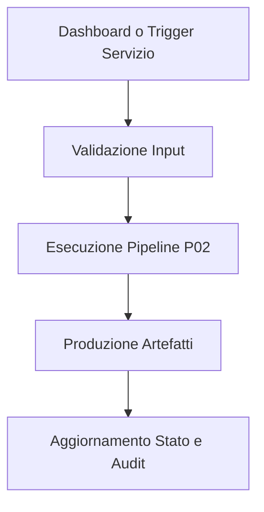

# P02 - Verifiche DM96 TA SLU

## 1. Scopo e perimetro
Verifiche DM96 TA e SLU.

## 2. Stato attuale della pipeline
Stato dichiarato: operativa.

## 3. Attori coinvolti
Utente, Dashboard, Servizi applicativi, Core calcolo, Reporting e Audit.

## 4. Trigger di ingresso
Avvio da dashboard, preset operativo, oppure esecuzione orchestrata da servizio.

## 5. Precondizioni e prerequisiti
Progetto valido, normativa selezionata, dati minimi disponibili.

## 6. Input richiesti
ProjectModel, CodeSettings, dati geometrici, materiali, carichi e opzioni operative.

## 7. Gate obbligatori all'ingresso
Dati minimi, coerenza unita, compatibilita norma, audit completeness.

## 8. Flowchart Mermaid della pipeline

## 9. Descrizione narrativa step-by-step del flusso
1. Raccolta input dal layer UI o orchestratore.
2. Validazione e controllo gate.
3. Esecuzione del nucleo specifico della pipeline.
4. Aggregazione esiti e metriche.
5. Persistenza output e tracciabilita.

## 10. Stati intermedi e transizioni visibili in dashboard
Non caricato, pronto, in esecuzione, completato con warning, completato OK o NON OK.

## 11. Output della pipeline
Esiti verifica, indicatori di utilizzazione, stato globale, warnings.

## 12. Artefatti prodotti o aggiornati
ResultsModel, ReportArtifact, ActionReport, export HTML MD JSON, trace summary.

## 13. Moduli e simboli reali del codice coinvolti
Hook principale: src/methods/checks_dm96.py.

## 14. Dipendenze da altre pipeline
Dipende da P22 per I O progetto, da P00 per orchestrazione, da P25-P26 per report e audit.

## 15. Failure modes, warning e gestione anomalie
Input incoerenti, incompatibilita norma, dipendenze mancanti, warning di qualita dati.

## 16. Gap attuali rispetto alla visione target
Dichiarare eventuali feature parziali o roadmap senza overclaim.

## 17. KPI o indicatori di qualita della pipeline
Copertura normativa, ripetibilita output, tempo medio esecuzione, completamento audit.

## 18. Decisioni architetturali e note implementative
Separazione GUI e core, funzioni pure nel calcolo, orchestrazione nei servizi.

## 19. Esclusioni di scopo
Nessuna implementazione non tracciata; fuori scope le feature non ancora codificate.

## 20. Checklist di accettazione del documento
- Frontmatter completo.
- Flowchart presente.
- Gate e artefatti esplicitati.
- Hook codice presente.
- Gap dichiarati.
