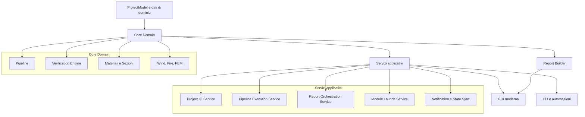
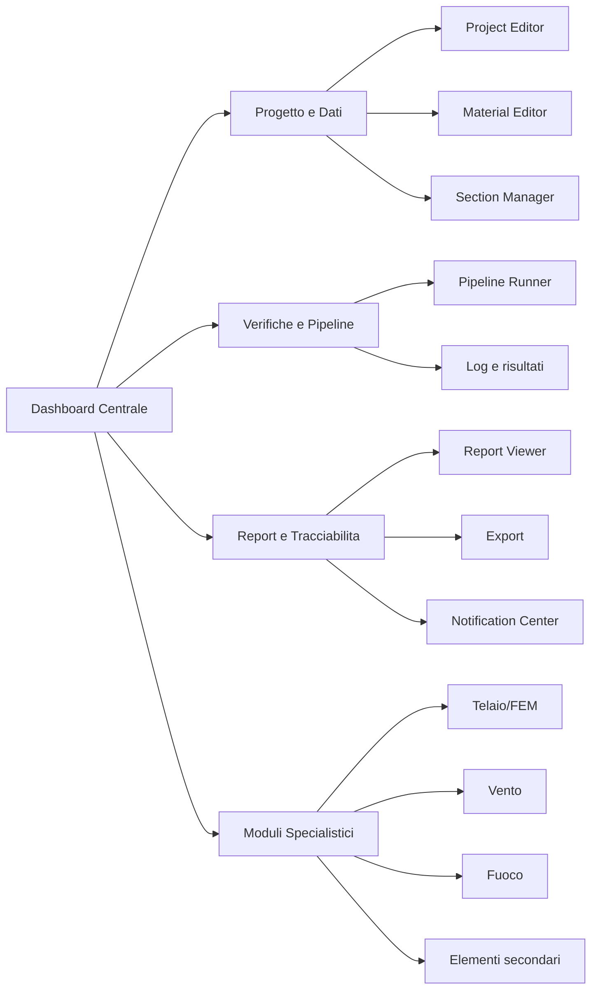
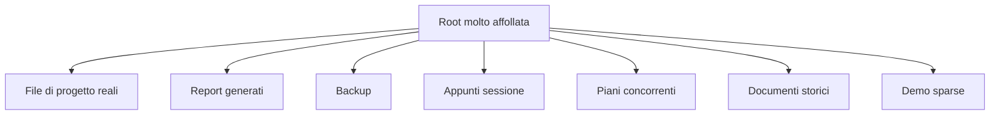
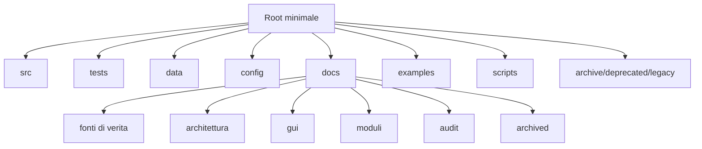

# Masterplan Ristrutturazione Workspace RD2229

## Stato esecuzione sessione

- Sessione unica attiva: SI
- Fase corrente: R1-R2 (esecuzione iniziale)
- Avanzamento tranche iniziale: completata
- Avanzamento tranche estesa root/docs: completata

Azioni eseguite:

1. Creati contenitori target:
    - `examples/projects/`
    - `examples/reports/`
    - `docs/generated/ci/`
2. Spostati file demo/output dalla root:
    - `00_Progetto_di_test.jsonp` -> `examples/projects/00_Progetto_di_test.jsonp`
    - `00_Progetto_di_test.jsonp.backup` -> `examples/projects/00_Progetto_di_test.jsonp.backup`
    - `00_Progetto_di_test.jsonp.migrated.json` -> `examples/projects/00_Progetto_di_test.jsonp.migrated.json`
    - `00_Progetto_di_test_report.html` -> `examples/reports/00_Progetto_di_test_report.html`
    - `00_Progetto_di_test_report.md` -> `examples/reports/00_Progetto_di_test_report.md`
    - `ci_pytest_report.xml` -> `docs/generated/ci/ci_pytest_report.xml`
3. Aggiornati i riferimenti nel README ai nuovi path del progetto demo.
4. Aggiornato `.gitignore` per escludere i report CI XML generati.
5. Archiviate note e summary storici in `docs/archived/`:
    - `Session_*.md` -> `docs/archived/session_notes/`
    - `BLOCCO 01..12.txt` -> `docs/archived/session_notes/`
    - `COMPLETAMENTO_TASK.md` -> `docs/archived/summaries/`
6. Spostati i piani storici in `docs/archived/planning/` con stub di compatibilita in root:
    - `Plan_master.md`
    - `Plan_master2.md`
    - `PLANCODE.md`
7. Creato documento regole archivio: `docs/archived/README.md`.
8. Avviata R3 con indice tematico documentazione:
    - `docs/reorganization/INDICE_TEMATICO_DOCS_R3_2026-03-25.md`
9. Avviata R4 con backlog di service split:
    - `docs/reorganization/BACKLOG_R4_SERVICE_SPLIT_2026-03-25.md`
10. Avvio implementazione R4 (code): estratti servizi base da `src/ui/modern/services/__init__.py`:
    - `src/ui/modern/services/action_report.py`
    - `src/ui/modern/services/project_io_service.py`
    - `src/ui/modern/services/calculation_service.py`
11. Facade retrocompatibile mantenuta in `src/ui/modern/services/__init__.py`.
12. Test mirato eseguito: `tests/test_modern_ui_nongui.py` -> 29 passed, 0 failed.
13. Riattivati quality gates CI minimi con workflow attivi:
    - `.github/workflows/python-ci.yml`
    - `.github/workflows/lint-test.yml`
14. Completata estensione R2 su inventario root e mapping archivio:
    - `docs/reorganization/ROOT_INVENTORY_2026-03-25.md`
    - `docs/reorganization/ARCHIVE_MAPPING_2026-03-25.md`
15. Spostati file snapshot/patch dalla root:
    - `apply_from_chat_plan.patch` -> `docs/archived/patches/`
    - `tree_*.txt`, `project_tree.txt` -> `docs/archived/snapshots/`
16. Rafforzati stub transitori root (`Plan_master*.md`, `PLANCODE.md`) con redirect esplicito e target rimozione 2026-04-15.

Vincolo operativo applicato:

- Migrazione fisica eseguita solo su file a basso rischio e con riferimenti verificati.

## 1. Obiettivo

Ristrutturare il repository RD2229 come prodotto tecnico mantenibile, leggibile e governabile,
separando in modo netto:

- codice di produzione;
- documentazione viva;
- archivio storico;
- output generati;
- moduli legacy da eliminare;
- GUI moderna attiva e moduli specialistici collegati.

Questo masterplan e il documento operativo centrale della ristrutturazione.
Non sostituisce `docs/PIANO_LAVORO.md` e `docs/PIANO_LAVORO_GUI.md`, ma ne consolida
le decisioni trasversali in un piano esecutivo unico.

## 2. Decisioni confermate in sessione

- Strategia di riordino: aggressiva.
- Root target: minimale.
- Struttura documentale: per temi, non per accumulo storico.
- GUI target: dashboard centrale come hub operativo.
- Priorita GUI iniziali: Progetto e Dati, Materiali, Sezioni.
- Compatibilita storica: e ammessa una migrazione con rottura controllata dei path.
- Legacy GUI Tkinter: da eliminare progressivamente.
- Prima tranche implementativa: documentazione strutturale e masterplan dedicato.

## 3. Diagnosi sintetica

### 3.1 Problemi attuali

1. Root repository sovraccarica di file eterogenei.
2. Documentazione dispersa fra piani, audit, summary, note di sessione e report storici.
3. GUI moderna gia presente ma non ancora governata come sistema unico completo.
4. Servizi applicativi concentrati in moduli troppo larghi.
5. Legacy, archivio e output generati non separati in modo rigoroso.

### 3.2 Aree gia solide

- `src/` contiene gia un nucleo tecnico consistente.
- `docs/PIANO_LAVORO.md` e gia fonte di verita generale.
- `docs/PIANO_LAVORO_GUI.md` e gia fonte di verita tecnica GUI.
- Esistono gia widget Qt reali per progetto, pipeline, report, materiali e sezioni.
- Esiste gia una shell moderna in `src/ui/modern/main_window.py`.

## 4. Obiettivo architetturale target

### 4.1 Repository target

```text
RD2229/
├── src/                    # codice di produzione
├── tests/                  # test attivi
├── data/                   # dataset runtime
├── config/                 # loader e configurazioni di sistema
├── docs/
│   ├── PIANO_LAVORO.md     # fonte di verita generale
│   ├── PIANO_LAVORO_GUI.md # fonte di verita GUI
│   ├── reorganization/     # piano di ristrutturazione workspace
│   ├── architecture/       # architettura target e diagrammi
│   ├── gui/                # blueprint GUI, mockup, mapping moduli
│   ├── modules/            # documentazione per dominio tecnico
│   ├── audit/              # audit correnti leggibili
│   ├── adr/                # decisioni architetturali
│   ├── generated/          # report generati da tenere se utili
│   └── archived/           # storico, sessioni, note, piani superati
├── examples/               # progetti demo e output esempio
├── scripts/                # automazioni operative
├── archive/                # archivio tecnico residuo da smaltire
├── deprecated/             # area da spegnere
└── legacy/                 # ultimo residuo storico da eliminare
```

### 4.2 Architettura software target



### 4.3 Architettura GUI target



## 5. Prima e dopo del workspace

### 5.1 Stato attuale semplificato



### 5.2 Stato target



## 6. Roadmap eseguibile

### Fase R1 — Audit strutturale e mappa rischi

Obiettivo: classificare ogni famiglia di file e identificare dipendenze a path.

Azioni:
- censimento root e documentazione;
- validazione riferimenti in codice, test, script e workflow;
- tabella keep/move/archive/delete-progressive;
- identificazione dei path ad alto rischio.

Deliverable:
- inventario strutturale del repository;
- mappa rischi di migrazione;
- policy di classificazione contenuti.

### Fase R2 — Root minimale e tassonomia cartelle

Obiettivo: ridurre drasticamente il rumore cognitivo nella root.

Azioni:
- definire cartelle target per docs, generated, archived ed examples;
- spostare demo, backup e output fuori dalla root;
- introdurre policy su file generati e output CI;
- isolare le aree in decommissioning.

Deliverable:
- nuova mappa repository;
- policy di collocazione file;
- prima pulizia fisica controllata.

### Fase R3 — Consolidamento documentale per temi

Obiettivo: rendere `docs/` navigabile per funzione.

Azioni:
- creare domini documentali stabili;
- distinguere documentazione viva da storico;
- centralizzare i rimandi nelle fonti di verita;
- definire template uniformi per nuovi documenti.

Deliverable:
- indice documentale tematico;
- policy di creazione nuovi documenti;
- archivio storico separato.

### Fase R4 — Rifattorizzazione architetturale core-servizi-UI

Obiettivo: chiarire responsabilita e confini del software.

Azioni:
- formalizzare i tre strati target;
- segmentare i servizi oggi monolitici;
- standardizzare i contratti tra ProjectModel, ResultsModel e UI;
- classificare i moduli specialistici per livello di integrazione.

Deliverable:
- blueprint architetturale aggiornato;
- matrice responsabilita modulo/servizio/UI;
- backlog di refactor tecnico.

### Fase R5 — Unificazione GUI moderna

Obiettivo: trasformare la GUI in un sistema unico coerente.

Azioni:
- consolidare la dashboard centrale;
- completare macro-settori e launcher;
- collegare editor progetto, materiali, sezioni, pipeline e report;
- definire stato condiviso e segnali di sincronizzazione.

Deliverable:
- flusso utente continuo end-to-end;
- registry GUI esteso;
- mappa moduli-vs-finestra.

### Fase R6 — Decommissioning legacy

Obiettivo: eliminare la dipendenza concettuale e tecnica dal passato.

Azioni:
- isolare Tkinter e tool obsoleti;
- rimuovere entrypoint e selector non piu necessari;
- spegnere gradualmente i test legacy;
- documentare esplicitamente cosa non fa piu parte del prodotto.

Deliverable:
- checklist di eliminazione legacy;
- perimetro prodotto ufficiale;
- riduzione del carico cognitivo manutentivo.

## 7. Matrice modulo -> settore GUI target

| Dominio | Modulo principale | Settore GUI target | Stato target |
|---|---|---|---|
| Progetto | Project Editor | Progetto e Dati | Integrato centralmente |
| Materiali | Material Editor | Progetto e Dati | Integrato centralmente |
| Sezioni | Section Manager + Visualizzatore | Progetto e Dati | Integrato centralmente |
| Verifiche | Pipeline Runner | Verifiche e Pipeline | Integrato centralmente |
| Report | Report Viewer | Report e Tracciabilita | Integrato centralmente |
| Stato applicativo | Notification Center | Report e Tracciabilita | Integrato centralmente |
| FEM/Telai | Telaio Window | Moduli Specialistici | Collegato al progetto |
| Vento | Wind service/widget | Moduli Specialistici | Collegato al progetto |
| Fuoco | Fire service/widget | Moduli Specialistici | Collegato al progetto |
| Elementi secondari | moduli X6/X8 e affini | Moduli Specialistici | Collegato al progetto |

## 8. Mockup wireframe iniziali

### 8.1 Dashboard centrale

```text
+----------------------------------------------------------------------------------+
| RD2229 | Progetto attivo | Norma | Warning | Ultimo export | Ricerca moduli      |
+----------------------------------------------------------------------------------+
| [Nuovo] [Apri] [Salva] [Esegui] [Report] [Export]                                |
+--------------------------------------+-------------------------------------------+
| Card modulo                          | Stato progetto                            |
| - Progetto e Dati                    | - progetto corrente                       |
| - Materiali                          | - norma attiva                            |
| - Sezioni                            | - ultimo run                              |
| - Pipeline                           | - esiti sintetici                         |
| - Report                             | - warning                                 |
| - FEM/Telai                          |                                           |
| - Vento                              | Recenti                                   |
| - Fuoco                              | - progetto 1                              |
| - Elementi secondari                 | - progetto 2                              |
+--------------------------------------+-------------------------------------------+
| Feed operativo / notifiche / log rapido                                           |
+----------------------------------------------------------------------------------+
```

### 8.2 Settore Progetto e Dati

```text
+----------------------------------------------------------------------------------+
| Progetto e Dati                                                                   |
+------------------------------+---------------------------------------------------+
| Metadati progetto            | Geometria elementi                                |
| - nome                       | tabella editabile                                 |
| - descrizione                | azioni CRUD                                       |
| - norma                      | preview sintetica                                 |
| - autore                     |                                                   |
+------------------------------+---------------------------+-----------------------+
| Materiali                    | Sezioni                   | Input normativi       |
| tabella + editor             | manager + preview         | code/seismic/fire     |
+----------------------------------------------------------------------------------+
| Validazioni, warning, stato salvataggio                                           |
+----------------------------------------------------------------------------------+
```

### 8.3 Settore Verifiche e Pipeline

```text
+----------------------------------------------------------------------------------+
| Verifiche e Pipeline                                                              |
+------------------------------+---------------------------------------------------+
| Configurazione run           | Risultati                                        |
| - norma                      | tabella esiti                                    |
| - set verifiche              | grouping per norma/stato limite                  |
| - selezione elementi         |                                                   |
+------------------------------+---------------------------------------------------+
| Progress bar | log scrollabile | export CSV/JSON | warning | annulla            |
+----------------------------------------------------------------------------------+
```

### 8.4 Finestra modulo specialistico collegato

```text
+----------------------------------------------------------------------------------+
| Modulo specialistico: FEM/Telai                                                   |
+------------------------------+---------------------------------------------------+
| Input del modulo             | Canvas / output modulo                            |
| tutti nella stessa finestra  | preview risultati                                 |
| collegati al progetto attivo | tracciamento locale                               |
+------------------------------+---------------------------------------------------+
| [Salva nel progetto] [Esegui] [Chiudi]                                            |
+----------------------------------------------------------------------------------+
```

## 9. Rischi operativi

| Rischio | Impatto | Mitigazione |
|---|---|---|
| Spostamento file con riferimenti hardcoded | Alto | audit path prima dei move |
| Eccesso di documenti duplicati | Alto | indice unico + policy docs |
| Dashboard senza stato condiviso | Alto | service split prima del refactor UI pesante |
| Rimozione legacy troppo precoce | Medio | decommissioning per fasi |
| Cartelle archive/deprecated ambigue | Medio | definizioni formali per ogni area |

## 10. Criterio di done per la ristrutturazione

La ristrutturazione puo dirsi riuscita quando sono vere tutte queste condizioni:

1. La root e leggibile senza contesto storico implicito.
2. Ogni famiglia documentale ha una collocazione unica e giustificata.
3. `docs/PIANO_LAVORO.md` e `docs/PIANO_LAVORO_GUI.md` restano leggere e governanti.
4. La GUI moderna espone un flusso continuo da progetto a report.
5. I moduli prioritari Progetto, Materiali e Sezioni sono collegati nativamente.
6. Il legacy non guida piu ne il flusso utente ne la manutenzione ordinaria.

## 11. Prossima tranche raccomandata

Tranche successiva consigliata:

1. creare inventario dettagliato del caos con tabella keep/move/archive/delete;
2. definire struttura target di `docs/` e iniziare la migrazione documentale a rischio basso;
3. estrarre il backlog di refactor da `src/ui/modern/services/__init__.py` e `src/ui/modern/main_window.py`;
4. progettare il registry GUI esteso con mapping modulo -> card -> widget -> servizio.
